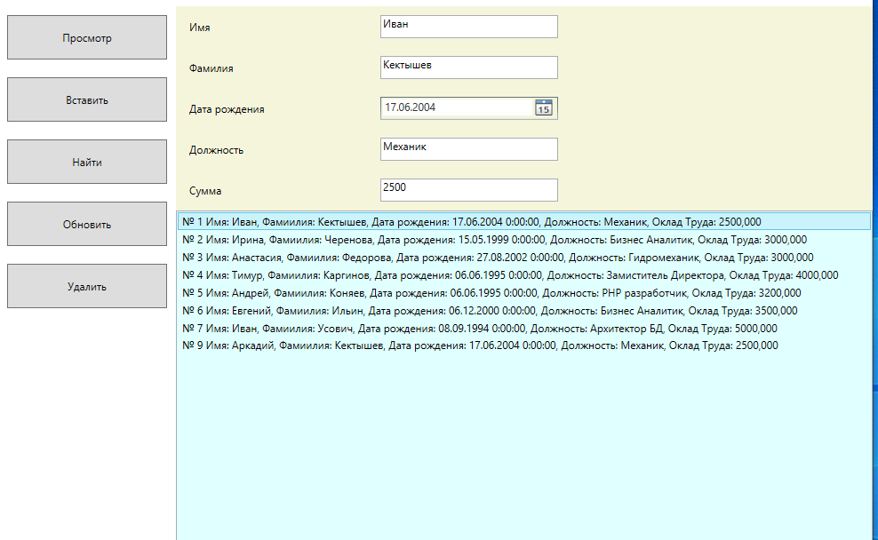

**ЛАБОРАТОРНАЯ РАБОТА №7**             
**Работа с базой данных в подключенном стиле** 

**1  Цель работы** 

Освоить  возможности  работы  с  базой  данных  на  основе  классов ADO.Net в подключенном стиле. 

**2  Постановка задачи** 

Для  заданной  в  индивидуальном  задании  предметной  области спроектировать  таблицу  БД,  в  которой  есть  4-5  полей.  Таблица  должна содержать допускающие присваивание значение поля NULL. 

Доступ  к  БД  реализовать  на  основе  шаблона  проектирования  Active Record  Программа  должна  иметь  возможность  отображать  все  записи таблицы, отображать записи, удовлетворяющие заданному критерию поиска, выполнять вставку и удаление записей. 

**3  Индивидуальные задания** 

Варианты предметной области для проектирования БД: 

7. Ресторанный бизнес 

**4 Пример выполнения лабораторной работы**

При нажатии на просмотр получаем список работников:

заполнив поля можно внести пользователя в список:

Также можно производит поиск по имени работника:

Выбрав из списка строку, можно ее обновить:

Кроме того, выбрав нужное строку можно ее удалить из списка:

**Работа с SqlDataAdapter и DataTable**

такой же результат можно добится с помощью использования SqlDataAdapter и DataTable:

Интерфейс как и в предыдущем примере, только здесь при нажатии на кнопку найти, будет всплывать вспомогательное окно, где по нужному параметру можно производить поиск:

а удаление можно осуществлять с помощью кнопки клавиатуры Del, вносить заказ можно прямо в таблицу, после нужно нажать на кнопку обновить, чтобы заказ появился в списке заказов.
